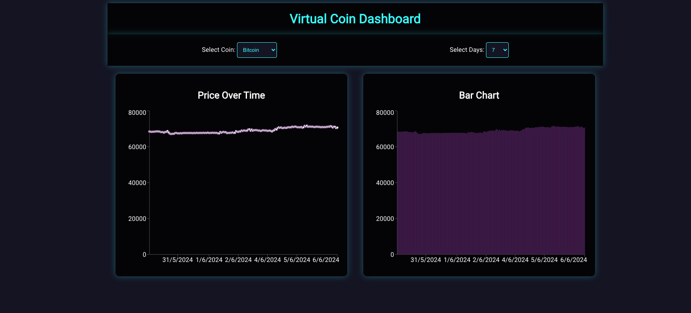

# CoinGecko Dashboard

Este proyecto es un dashboard interactivo que visualiza datos de criptomonedas usando la API de CoinGecko.

## Instalación

1. Clona el repositorio
2. Instala las dependencias:
   npm install

3. Ejecuta la aplicación:
   npm start

## Descripción

   Este proyecto configura una aplicación React utilizando TypeScript. Se instalaron las dependencias axios para realizar solicitudes HTTP, recharts para gráficos y styled-components para el diseño de estilos. La estructura del proyecto incluye componentes básicos como Chart, Filters y Header.

## Estructura del Proyecto

```bash

/src
|-- /components
|   |-- Chart.tsx
|   |-- Filters.tsx
|   |-- Header.tsx
|-- /services
|   |-- api.ts
|-- /styles
|   |-- GlobalStyles.ts
|-- App.tsx
|-- index.tsx

```

## Despliegue en Vivo

   [Enlace a la demostración en vivo](https://alexvazquez64.github.io/coingecko-dashboard/)

## Capturas de pantalla



## Funcionalidades

* Visualización de precios históricos de criptomonedas.
* Filtros para seleccionar diferentes criptomonedas y rangos de fechas.
* Gráficos interactivos con tooltips y leyendas.

## Tecnologías Utilizadas

* React
* TypeScript
* Recharts
* Styled-components
* Axios

## Autor

   Alejandro Vázquez
